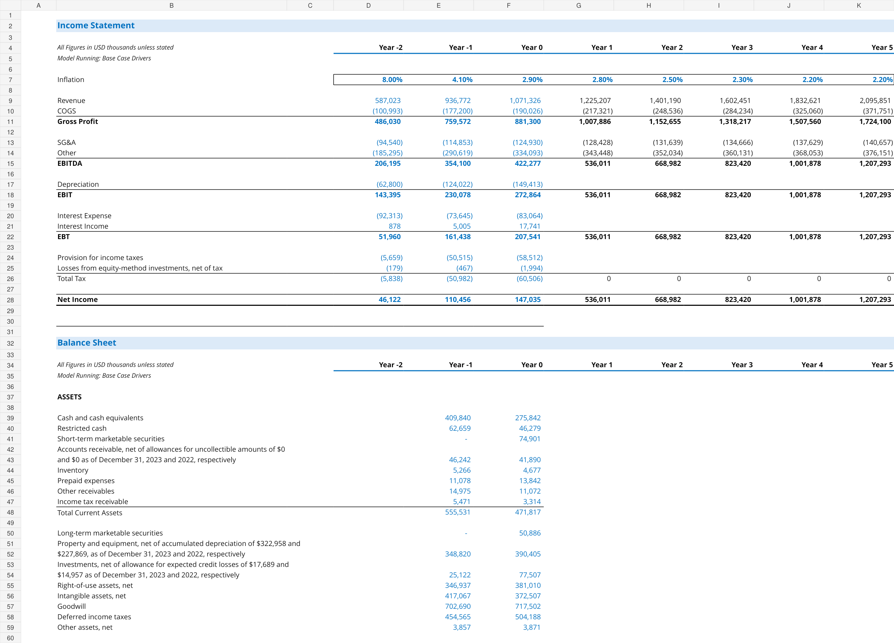
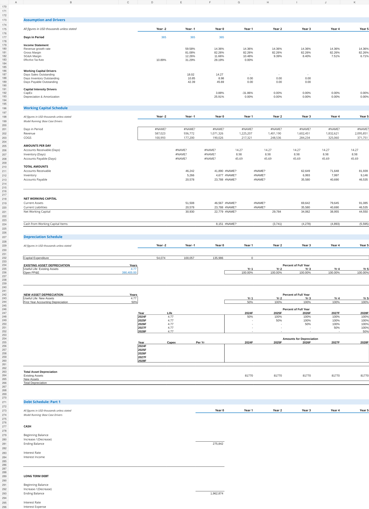

# Planet Fitness (NYSE: PLNT) — 3-Statement Financial Model & DCF Valuation

> **Project Status: In Progress**  
> Building a fully integrated three-statement financial model and discounted cash flow valuation for Planet Fitness, Inc. from public SEC filings.

This project is being built from a blank workbook to demonstrate practical financial modeling, forecasting, valuation, and FP&A-oriented analytical skills. The model uses historical financial data from Planet Fitness public filings, derives operating drivers from historical performance, and progressively links supporting schedules into a five-year integrated forecast.

## Project Objective

Build a professional financial model that:

- Standardizes historical Income Statement, Balance Sheet, and Cash Flow Statement data.
- Analyzes historical operating and working-capital drivers.
- Builds supporting schedules for working capital, PP&E/depreciation, and debt/interest.
- Forecasts the three financial statements over five years.
- Integrates the statements dynamically with automated balance checks.
- Calculates Unlevered Free Cash Flow and enterprise value using a DCF.
- Tests valuation outcomes using WACC, terminal growth, exit multiple, and scenario sensitivities.

## Current Build Status

| Module | Status | Current Work |
|---|---|---|
| Historical financial statements | ✅ Substantially complete | Historical IS, BS, and CFS organized from public filings |
| Historical driver analysis | 🟡 In progress | Revenue growth, margins, taxes, working-capital and capital-intensity drivers |
| Working capital schedule | 🟡 In progress | A/R, inventory, A/P and NWC forecast framework built |
| PP&E / depreciation schedule | 🟡 In progress | Roll-forward and depreciation framework under construction |
| Debt / interest schedule | 🟡 Started | Debt framework established; interest and debt sweep still to be completed |
| Five-year integrated forecast | 🟡 Started | Operating forecast initiated; full three-statement integration still in progress |
| DCF valuation | ⬜ Not started | Will follow completion of integrated forecast |
| Sensitivity analysis | ⬜ Not started | WACC / growth and WACC / exit multiple tables planned |
| Bull / Base / Bear cases | ⬜ Not started | Scenario toggles planned |
| Executive summary | ⬜ Not started | One-page valuation and findings summary planned |

## Model Architecture

### 1. Historical Financials
Historical company financial statements are standardized into a consistent modeling format to create the foundation for forecasting.

### 2. Operating Drivers
Historical performance is analyzed to derive forecast assumptions including:

- Revenue growth
- Gross margin
- SG&A as a % of revenue
- Effective tax rate
- Days Sales Outstanding (DSO)
- Days Inventory Outstanding (DIO)
- Days Payable Outstanding (DPO)
- CapEx as a % of revenue
- Depreciation as a function of PP&E

### 3. Supporting Schedules
Supporting schedules are being built separately from the main financial statements to keep the model transparent and auditable.

**Working Capital**

- Accounts Receivable forecast using DSO
- Inventory forecast using DIO
- Accounts Payable forecast using DPO
- Net Working Capital and annual changes in NWC

**PP&E and Depreciation**

- Beginning PP&E
- Capital expenditures
- Depreciation
- Ending PP&E roll-forward

**Debt and Interest**

- Beginning debt balances
- Mandatory repayments
- New borrowings / revolver activity
- Average debt balance
- Interest expense
- Planned dynamic cash / debt sweep

### 4. Integrated Forecast
The completed model will dynamically connect:

`Income Statement → Net Income → Cash Flow Statement → Ending Cash → Balance Sheet`

with supporting schedules feeding the relevant line items throughout the forecast.

### 5. DCF Valuation
The valuation section will calculate:

**Unlevered Free Cash Flow**

`UFCF = EBIT × (1 − Tax Rate) + D&A − CapEx − Change in NWC`

**WACC** using CAPM-derived cost of equity and after-tax cost of debt.

**Terminal Value** using both:

- Perpetuity Growth Method
- Exit Multiple Method

The model will bridge Enterprise Value to Equity Value and calculate implied intrinsic value per diluted share.

## Screenshots

### Model Overview

### Supporting Schedules

## Skills Demonstrated

`Financial Modeling` · `Three-Statement Modeling` · `Excel` · `Financial Statement Analysis` · `Forecasting` · `Working Capital Modeling` · `PP&E Modeling` · `Debt Modeling` · `DCF Valuation` · `WACC` · `Scenario Analysis` · `Sensitivity Analysis`

## Files

- [`model/Planet_Fitness_3_Statement_DCF_WIP.xlsx`](model/Planet_Fitness_3_Statement_DCF_WIP.xlsx) — current work-in-progress model.
- [`notes/BUILD_ROADMAP.md`](notes/BUILD_ROADMAP.md) — model construction roadmap and completion checklist.
- [`sources/README.md`](sources/README.md) — primary public-data source information.

## Data Source

Historical financial information is based on Planet Fitness, Inc. public SEC filings, including the Form 10-K for the fiscal year ended December 31, 2023, filed February 29, 2024.

Primary filing:  
https://www.sec.gov/Archives/edgar/data/1637207/000163720724000020/plnt-20231231.htm

## Planned Final Deliverables

When complete, this repository will include:

1. Fully integrated five-year three-statement model.
2. Automated balance-sheet check.
3. Working-capital, PP&E/depreciation, and debt/interest schedules.
4. DCF using perpetuity-growth and exit-multiple approaches.
5. WACC and terminal-value assumptions.
6. Two-way valuation sensitivity tables.
7. Bull / Base / Bear scenario analysis.
8. One-page executive valuation summary.
9. Valuation football field / summary visualization.

## Disclaimer

This project is an independent educational and portfolio exercise using publicly available information. It is not affiliated with Planet Fitness, Inc. and is not investment advice.
