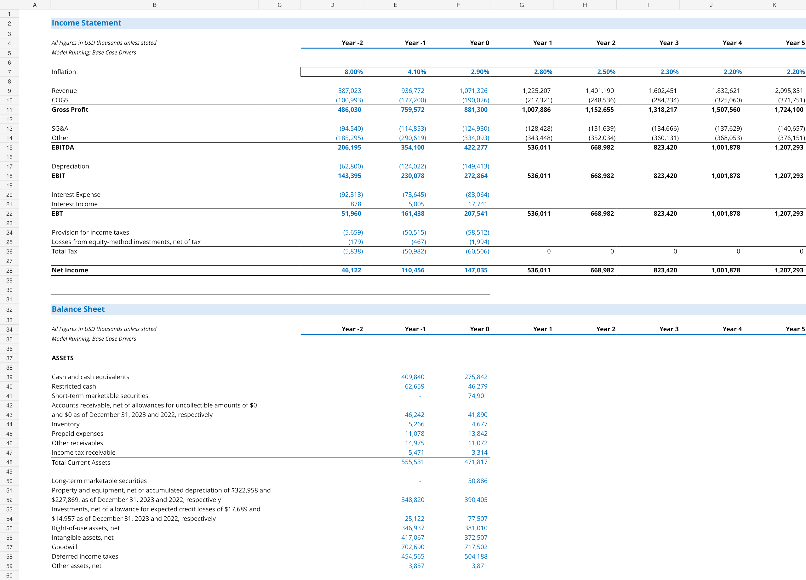
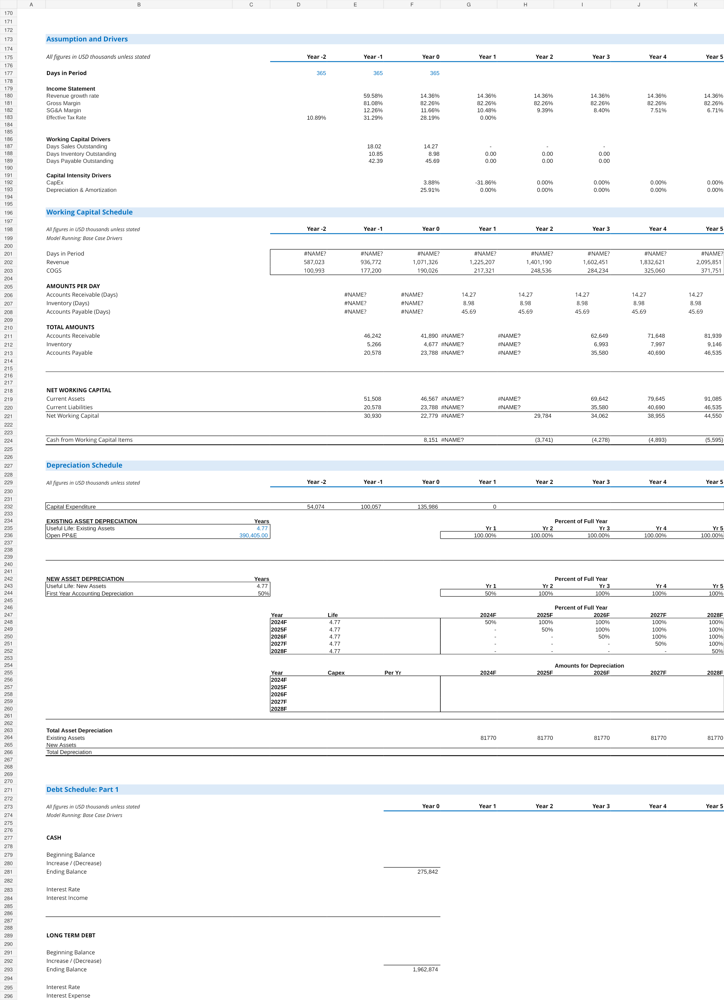

# Planet Fitness (NYSE: PLNT) - Integrated 3-Statement Model & DCF Valuation

**Completed: September 2026**  
**Author: Tyler Valle**  
**Portfolio:** https://tylervalle.com/projects/planet-fitness

A from-scratch financial modeling and valuation case study built from Planet Fitness, Inc. public filings. The project demonstrates the core work expected in Financial Analyst, FP&A, and valuation-oriented roles: historical financial statement analysis, driver-based forecasting, supporting schedules, three-statement integration, DCF valuation, sensitivity analysis, scenarios, market cross-checks, and executive communication.

> **Historical case-study basis:** FY2023 is Year 0 and the model uses a **Dec-2023 reference share price of $40.16**. This is a portfolio exercise, not a current 2026 investment recommendation.

## What I Built

- Standardized FY2021A-FY2023A Income Statement, Balance Sheet, and Cash Flow Statement data.
- Calculated historical revenue growth, margins, effective tax rate, DSO, DIO, DPO, capital intensity, and depreciation drivers.
- Built supporting schedules for working capital, PP&E/depreciation, debt, interest, minimum cash, and optional debt paydown.
- Built a fully integrated FY2024E-FY2028E three-statement forecast.
- Added automated balance-sheet checks; **all five forecast years balance**.
- Calculated UFCF and WACC using CAPM and after-tax cost of debt.
- Valued the business using both Gordon Growth and Exit EV/EBITDA terminal-value methods.
- Built 5x5 sensitivity tables for WACC vs. perpetual growth and WACC vs. exit multiple.
- Built Bear / Base / Bull scenarios.
- Added trading-comps cross-checks and a valuation football field.
- Created a one-page executive valuation memo.

## Model Audit & Corrections

The first model pass produced an unusually high valuation, so I audited the economics rather than accepting the output mechanically.

- **CapEx:** Replaced a 3.8% net-PP&E-growth proxy with FY2023 actual capital intensity of approximately **12.7% of revenue**.
- **Depreciation:** Capped depreciation on the existing PP&E base so cumulative depreciation cannot exceed remaining assets.
- **Debt:** Added mandatory repayment, minimum-cash preservation, optional paydown, revolver logic, and average-balance interest economics.
- **Working capital:** Linked DSO / DIO / DPO to centralized driver assumptions.
- **Integration:** Repaired disconnected forecast lines so statement changes flow through cash and the balance sheet.
- **Controls:** Added balance, scenario, and sensitivity checks.

## Base-Case Valuation Snapshot

| Metric | Result |
|---|---:|
| WACC | 6.63% |
| Gordon Growth implied value / share | $149.69 |
| Exit Multiple implied value / share | $141.26 |
| Blended Base DCF | $145.47 |
| Bear blended DCF | $74.12 |
| Bull blended DCF | $158.19 |
| Dec-2023 reference price | $40.16 |

The result is highly assumption-sensitive. The executive summary therefore presents a **range**, not a single target price, and highlights terminal-value concentration, WACC sensitivity, operating leverage, growth durability, and capital intensity.

## Model Architecture

### 1. Historical Financials
FY2021A-FY2023A statements are standardized into a consistent modeling layout and validated before forecasting.

### 2. Operating Drivers
Forecast assumptions cover revenue growth, gross margin, operating cost growth, tax rate, DSO, DIO, DPO, CapEx intensity, and depreciation.

### 3. Supporting Schedules
Working capital, PP&E/depreciation, and debt/interest are modeled separately and linked into the three statements.

### 4. Integrated Forecast

`Income Statement -> Net Income -> Cash Flow Statement -> Ending Cash -> Balance Sheet`

with supporting schedules feeding working capital, PP&E, debt, interest, and retained earnings.

### 5. DCF

`UFCF = EBIT x (1 - Tax Rate) + D&A - CapEx - Increase in NWC`

The DCF discounts five forecast years plus terminal value and bridges enterprise value to equity value per diluted share.

### 6. Sensitivities & Scenarios
Two-way sensitivity tables and Bear / Base / Bull cases make the valuation range explicit and show which assumptions matter most.

## Screenshots

### Model Overview

### Supporting Schedules

## Deliverables

- **Final Excel model:** [download from portfolio](https://tylervalle.com/downloads/Tyler_Valle_Planet_Fitness_3Statement_DCF_Final.xlsx)
- **Executive summary PDF:** [download from portfolio](https://tylervalle.com/downloads/Tyler_Valle_PLNT_Executive_Summary.pdf)
- **Interactive case study:** https://tylervalle.com/projects/planet-fitness
- [Source & assumption notes](sources/README.md)

## Skills Demonstrated

`Three-Statement Modeling` · `Financial Statement Analysis` · `Forecasting` · `Working Capital Modeling` · `PP&E Modeling` · `Debt Modeling` · `DCF Valuation` · `WACC` · `Scenario Analysis` · `Sensitivity Analysis` · `Trading Comps` · `Excel` · `Executive Communication`

## Data Source

Historical financial data is based on Planet Fitness, Inc. FY2023 Form 10-K and related public filings.

Primary filing:  
https://www.sec.gov/Archives/edgar/data/1637207/000163720724000020/plnt-20231231.htm

## Disclaimer

This project is an independent educational and portfolio exercise using publicly available information. It is not affiliated with Planet Fitness, Inc. and is not investment advice.
